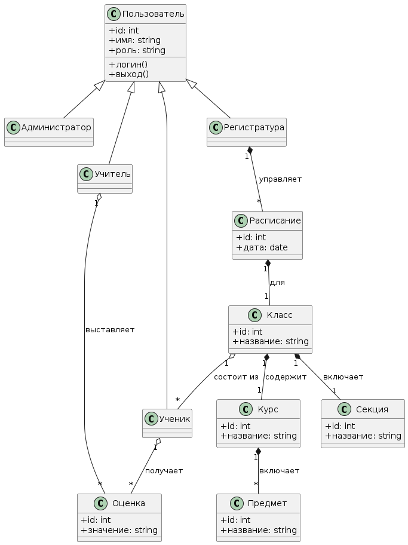
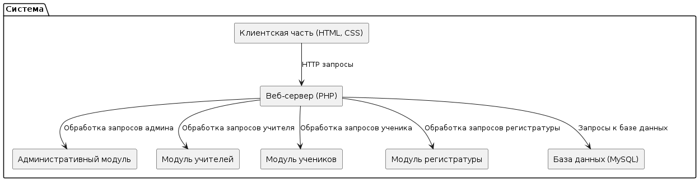
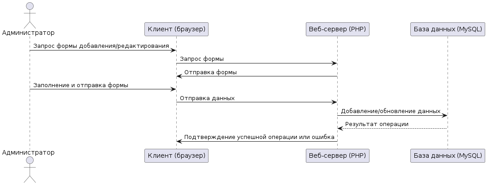
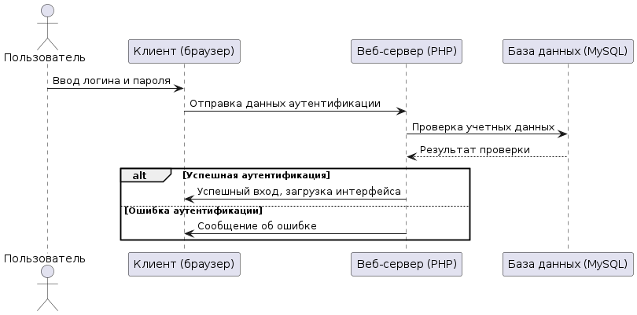
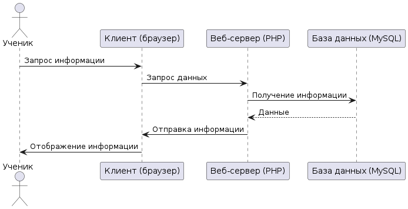
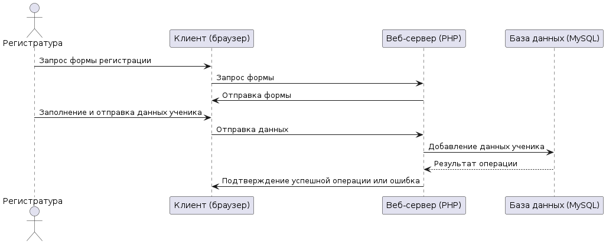
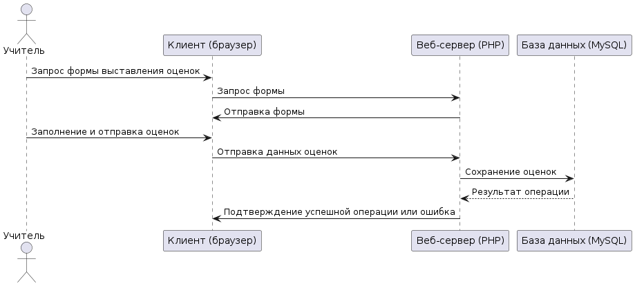
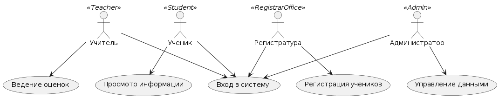

# Архитектурные диаграммы системы электронного школьного журнала

## Введение

Данный документ описывает архитектурные диаграммы системы электронного школьного журнала, разработанной в соответствии с ГОСТ 34, ГОСТ 19, IEEE STD 830-1998, ISO/IEC/IEEE 29148-2011.

## 1. Диаграмма классов

Диаграмма классов отображает основные классы и их связи в системе:

- Класс User (Пользователь) с подклассами Admin, Teacher, Student, RegistrarOffice
- Классы для управления данными: Class, Course, Grade, Schedule, Section, Subject
- Классы для аутентификации и сессий
- Связи между классами отражают владение и ассоциации

## 2. Диаграмма компонентов

Диаграмма компонентов показывает модули системы и их взаимодействия:

- Административный модуль
- Модуль учителей
- Модуль учеников
- Модуль регистратуры
- Веб-сервер с PHP-скриптами
- Клиентская часть (HTML, CSS)
- База данных MySQL

## 3. Диаграмма последовательностей

Диаграмма последовательностей иллюстрирует взаимодействие компонентов при основных сценариях:

- Вход пользователя в систему (аутентификация)
- Добавление/редактирование данных администраторами
- Ведение оценок учителями
- Просмотр информации учениками
- Регистрация и учет учеников

## 4. Диаграмма вариантов использования

Диаграмма вариантов использования показывает основных акторов системы и их взаимодействия с функционалом.

